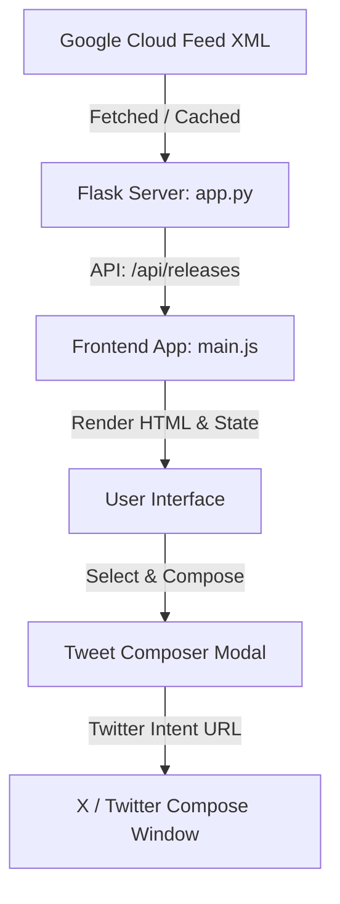

# BigQuery Release Hub

BigQuery Release Hub is an elegant web application built using Python Flask (backend) and pure vanilla HTML, CSS, and JavaScript (frontend). It fetches Google Cloud's BigQuery release notes XML feed, parses entries into granular updates, and provides a sleek user interface to search, filter, and share selected updates on X/Twitter.

---

## ✨ Features

*   **Granular Parsing**: Google Cloud groups releases daily. This app parses each daily summary and extracts individual updates (Features, Fixes, Announcements, Changes, General updates).
*   **Deep Space Dark Theme**: Modern dark mode UI styling, featuring translucent glassmorphism panels, glowing borders, custom scrolling, and keyframe animations.
*   **Dynamic Stats Dashboard**: Animates statistics counters (Total Releases, Features, Announcements, Fixes) on load.
*   **Search & Tag Filters**: Instant client-side search indexing that screens dates, categories, titles, and text.
*   **Twitter / X Composer & Live Preview Mockup**:
    *   **Circular SVG Progress Indicator**: Glows Teal ➔ Amber ➔ Rose based on the 280-character limit.
    *   **Pre-built Share Templates**: Supports multiple styles (Default, Short, Feature Spotlight, Raw Text).
    *   **Live Preview Mock**: Visualizes exactly what the Tweet will look like in dark mode.
*   **Multi-Select Summary**: Select multiple cards across different dates to compile and share a combined release summary.
*   **Smart Caching**: Cache entries in memory for 5 minutes (`releases_cache.json`) to prevent rate limits, with a manual refresh override.

---

## 🛠️ Architecture



---

## 📂 Project Structure

```
bigquery_releases/
│
├── app.py                  # Flask application & Feed parsing logic
├── releases_cache.json     # 5-minute local JSON cache (Git ignored)
├── .gitignore              # Files ignored by git
├── README.md               # Project documentation
│
├── templates/
│   └── index.html          # SPA HTML structure & Modals
│
└── static/
    ├── css/
    │   └── style.css       # Custom design system, grids, and themes
    └── js/
        └── main.js         # Client state, animations, search, and composer
```

---

## 🚀 Quickstart & Setup

### Prerequisites
Make sure you have Python 3 and Flask installed:
```bash
pip install flask
```

### Installation & Run
1. Clone this repository:
   ```bash
   git clone https://github.com/SantoshAdapa/SantoshAdapa-agy-cli-experimentation.git
   cd SantoshAdapa-agy-cli-experimentation
   ```
2. Start the Flask application:
   ```bash
   python app.py
   ```
3. Open your browser and navigate to:
   👉 **`http://127.0.0.1:5000`**

---

## 📝 Customization Settings

Default configuration variables inside [app.py](file:///C:/Users/saisa/bigquery_releases/app.py):
*   `CACHE_EXPIRY` (default `300` seconds): The duration parsed feed records remain in the local cache before a fresh call is forced.
*   `FEED_URL`: Point to alternative Google Cloud Release RSS URLs (e.g., Cloud Spanner, Vertex AI) to parse other service updates.
